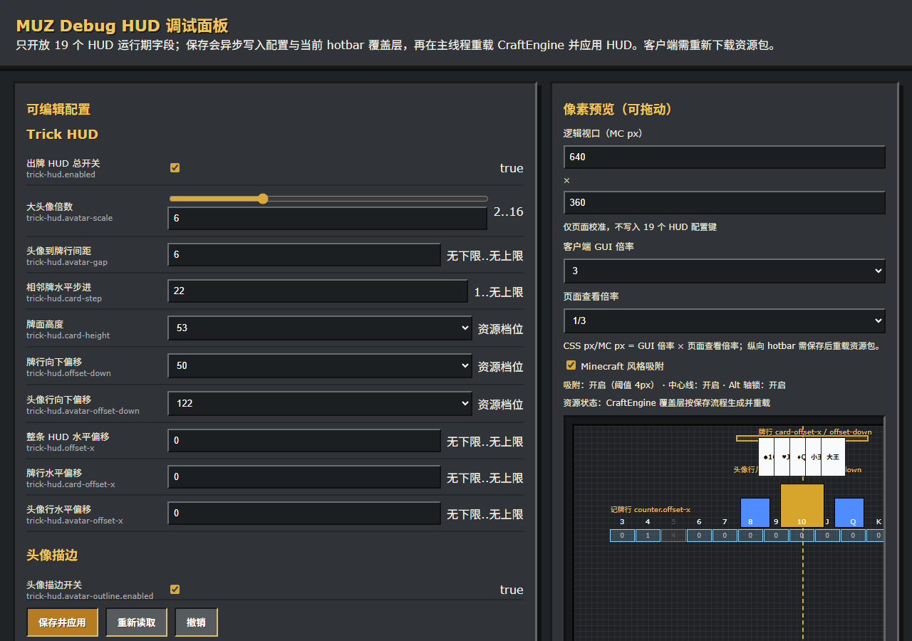
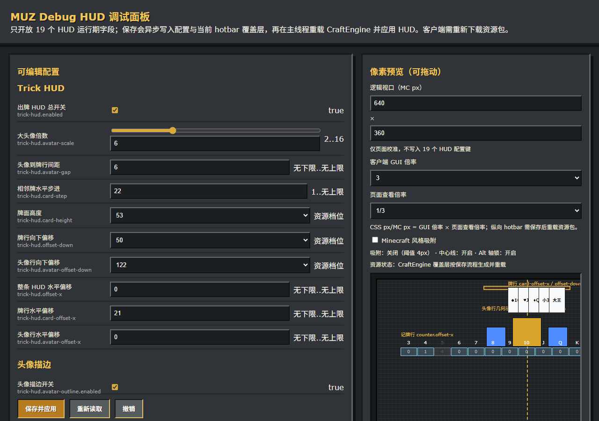

# MUZ

一个面向 `Paper 1.21.11+` 与 `Purpur 1.21.11+` 的斗地主插件原型。

当前文档对应版本：`1.10.15`（尚未部署）。

## 已实现

- 3 人建桌、加入、准备、开局
- 随机叫分，最高叫分者成为地主
- 发 17 张手牌，地主获得 3 张底牌
- 实体手牌选择与出牌
- 记牌器固定显示 15 格，普通点数显示本局累计已出 0..4 张、大小王各 0..1 张。上方牌类、下方闭合矩形框和数字按 `label → frame → digit` 分层叠加；ascent 为 `16/-4/-7-downOffset`，后两层以 `offset(-34)` 复用同一格，label/digit PNG 右下角用不可见 alpha=1 锁定 33px 实际宽度。每格前进 34px，默认整行 538px；耗尽时置灰或隐藏三层但不移动后续格子
- 牌面贴图、按钮图标与完整斗地主音效资源包；资源包内 125 个 OGG 按原路径逐个使用 ffmpeg 压缩，保持文件名与 OGG Vorbis 格式，仅以有效且更小的结果替换
- 单牌、对子、三张、三带一、三带二
- 四带二、四带两对、顺子、连对
- 飞机、飞机带单翼、飞机带双翼
- 炸弹、王炸与基础倍数结算
- 真人跟牌无牌可压时保留当前回合等待 20 tick；期间可点击现有「不要」立即跳过，未操作才自动不要；等待期间其他玩家的 ActionBar 与倒计时仍正常更新，机器人仍立即处理
- 对局中离线/踢出自动重置
- 自动生成 CraftEngine bundle，可导出到 `CraftEngine/resources/doudizhupaper`
- 提供一套默认关闭的第三方 AI gateway，可按 DeepSeek 或其他 OpenAI 兼容接口接入

## 命令

- `/muz create <high|mid|low|fun> [id]`
- `/muz create <doudizhu|texas> <high|mid|low|fun> [id]`
- `/muz set <牌桌id> <high|mid|low|fun>`
- `/muz chip mode <gold|chip>`
- `/muz chip setitem`
- `/muz chip balance <玩家> [数量]`
- `/muz remove <牌桌名>`
- `/muz reload`
- `/muz admin`
- `/muz bot <add|remove> [名字]`
- `/muz list`
- `/muz settings`（不在牌桌里也能打开）
- `/muz labels`（兼容旧命令，等同 `/muz settings`）
- `/muz status`
- `/muz forceend`
- `/muz debug add [数量]` — 在附近生成会自己打牌的观察桌（测试用，跳过桌面/椅子方块占用检测；例如 `/muz debug add 99`）
- `/muz debug remove [1-50|all]` — 移除最近的观察桌，或全部移除
- `/muz debug web` — 查看 Debug Web 面板运行状态与本机访问地址（需 `muz.admin`）
- `/muz debug web start` — 手动启动 Debug Web 面板（需 `debug.web-ui.enabled: true`；只监听回环地址）
- `/muz debug web stop` — 停止 Debug Web 面板
- `/muz give debug` — 发放个人 HUD 调试棒；未进牌桌时可显示与 Debug Web 对照的游戏内 Trick HUD。右键循环牌行、头像行、记牌行，Shift+右键隐藏。

正式 Trick HUD 由 `TrickHudService` / `TrickHudView` 在出牌阶段按配置和玩家级调试棒行覆盖渲染；Debug Web 只负责回环地址上的 HUD 参数预览与运行期配置。`/muz give debug` 的调试棒只影响持有者个人，不写入运行期正式配置；`/muz debug show|stick|hud` 继续移除。

## Debug Web HUD 配置页

- 开启 `debug.web-ui.enabled: true` 后，仅可从服务端本机访问 `http://127.0.0.1:<port>` / `http://localhost:<port>`。
- 页面可编辑字段共 19 个：`trick-hud.enabled`、`trick-hud.avatar-scale`、`trick-hud.avatar-gap`、`trick-hud.card-step`、`trick-hud.card-height`、`trick-hud.offset-down`、`trick-hud.avatar-offset-down`、`trick-hud.offset-x`、`trick-hud.card-offset-x`、`trick-hud.avatar-offset-x`、`trick-hud.avatar-outline.enabled`、`trick-hud.avatar-outline.color`、`trick-hud.counter.enabled`、`trick-hud.counter.gap`、`trick-hud.counter.hide-exhausted`、`trick-hud.counter.offset-x`、`hotbar-hud.enabled`、`hotbar-hud.offset-x`、`hotbar-hud.offset-y`。
- 牌高、牌行下移、头像行下移等档位字段按当前资源包的合法档位白名单校验，非法值会拒绝保存而不是静默改写。
- 页面右侧的预览按 Minecraft 像素坐标系绘制，屏幕基准几何固定为 `640×360`，BossBar baseline=20，ActionBar bottom=360。行宽与字形前进量由服务端 `DebugHudConfigController.currentGeometry()` 汇总 `PackAssets`、`PlayerHeadRenderer`、`HotbarDebugOverlayWriter` 后下发（`cards` / `avatars` / 固定 15 格分层 `counters` 几何 + hotbar 六项），前端**只消费这份 `PreviewGeometry`**，不再由 JS 复算字形表；居中用**整数 MC 像素**执行（`baseLeft=floor((screenWidth-W)/2)`，行内 `floor((W-行宽)/2)`），牌/头像走 `top = bossBarBaselineY - ascent` 公式，hotbar 走 `actionBarBottomY - hotbarHeight + ascentDelta`。记牌器 cell 按服务端下发的牌类、矩形框、数字分层几何绘制，累计已出张数固定在对应格内。画出 BossBar 轨道、屏幕中线、屏幕底边作参照物；GUI 缩放可在页面上切换（2/3/4，默认 3）。
- **预览各层可鼠标拖动**：牌行、头像行、记牌行、hotbar 拖动时只更新页面里的待提交偏移值（档位字段会吸附到最近的合法档）。页面提供 `snapToggle` Minecraft 风格吸附开关，默认开启；它只改变当前页面拖动行为，不混入 19 个 HUD patch，阈值按实际 layer 几何使用 Minecraft 像素。中心线与 Alt 首次有效位移锁轴状态保留。牌行来自 `geometry.cards` 按 `height` 查档，头像行来自 `geometry.avatars` 按 `scale` 查档并根据描边开关选 `plainAdvance` / `outlinedAdvance`；记牌器按固定 15 格和服务端下发的分层 cell 几何逐格定位，累计已出张数不改变后续格子的 x 位置，预览不自行依赖 MiniMessage 字体宽度。拖动期间只更新当前层的 CSS `transform`，不重建预览 DOM；松手后才完整刷新。拖动只标记未保存，需点「保存并应用」才写回 `config.yml`。
- 「保存并应用」只写回本次提交的白名单键；保存链路严格按“异步写入 `config.yml` 与 hotbar overlay YAML → 主线程启动 CE 真实重载 Future → 异步生成并校验实际 ZIP → 主线程应用 HUD → 发布 Snapshot”执行，不再把命令提交成功当作生成完成。空 patch 不触发资源流程，任一步失败不会报成功。两个 overlay YAML 使用临时文件后原子替换；120 秒超时只废弃本次结果，底层任务未结束时后续保存/重读直接拒绝，不重叠写盘，也不应用迟到结果；raw 真正结束后才释放租约，close/timeout 与最终主线程应用由任务闸门原子仲裁。服务端包内容校验不代表自动上传或客户端应用已经完成。
- Web 保存与 Web 磁盘重载共用单线程队列和插件提供的 HUD 配置锁：Web 自身不会让两次请求乱序，也不会把 `config.yml` 写盘放回主线程。该锁是清晰的 Web 快照边界，不等同于全局配置事务；旧的管理菜单或其他非 Web 配置入口若并发改写共享 `MuzYamlConfig`，仍需后续统一配置层才能完全消除竞态。
- 记牌器的资源契约使用构建期生成的分层位图 glyph，固定按 `label → frame → digit` 顺序绘制，images.yml 的 ascent 固定为 `label=16-downOffset`、`frame=-4-downOffset`、`digit=-7-downOffset`，View 对后两层使用 `offset(-34)`；label/digit PNG 右下角以 alpha=1 锚点锁定 Minecraft BitmapProvider 的 33px 实际宽度，Debug Web 预览数字使用服务端下发的 `playedCount` 累计已出张数。预览 hotbar 固定为完整 9 槽 182×22 底图，槽块 18×20 且从 x=2 起每 20px 排列，颜色严格采用 `#E03A3A,#E06A2A,#E08A2A,#D8D030,#3CC050,#30C0A8,#3888E0,#7050D8,#C04AA0`。Debug Web 只消费服务端下发的固定 15 格几何，不自行生成或复算字形；运行期 CE overlay 仍只用于 hotbar 覆盖层，客户端必须重新下载资源包才能看到 `offset-y` 的变化。
- 「重新读取配置」同样通过 HUD 专用异步重载链路，不调用完整 `reloadVisualState`，不会重建物理牌桌；它会丢弃网页里尚未保存的改动。
- `DebugWebServerTest` 现有覆盖 geometry schema、资源 API 对齐、旧几何魔数移除，以及拖动期间不重建预览 DOM、松手后再刷新；本次测试计划应覆盖固定 15 格分层记牌器 fixture、三层记牌器 glyph 的文件/尺寸/码位/YAML 对齐、15 格固定 advance、完整 9 槽 hotbar 逐像素几何与原版 sprite 禁止项，以及 125 个 OGG 的数量闭合、非空、Vorbis 流和资源索引引用。1.10.13 新增前端交互改进测试：粘性操作栏、键盘快捷键（Ctrl+S 保存、Ctrl+R 重载）、focus-visible 焦点环、成功消息自动淡出、窄屏溢出防护（main minmax(0,...)、panel min-width:0、key word-break、input min-width:0、preview max-width:100%，500px 以下字段堆叠）；溢出防护不在 body/.panel 上用 overflow 裁切（会破坏 sticky），测试精确提取 CSS 规则内容断言 sticky 祖先链无 overflow:hidden/auto/scroll。
- Hotbar 由 `hotbar-hud.enabled`、牌桌阶段与座位状态共同控制：**仅向处于 `GamePhase.PLAYING` 正式出牌阶段的牌桌在线真人座位显示**。出牌阶段推送 182×22 不透明底图，完整盖住原版 9 槽背景，并固定绘制 9 个纯色块（`#E03A3A,#E06A2A,#E08A2A,#D8D030,#3CC050,#30C0A8,#3888E0,#7050D8,#C04AA0`），不新增动态选中槽语义；`hotbar-hud.offset-x` 走运行期负空格，`hotbar-hud.offset-y` 走覆盖层 ascent。`LOBBY`、`BIDDING`、`DOUBLING`、结算、离桌、停服及不在牌桌的普通玩家始终保持或恢复原版 9 槽物品栏。所有非 `PLAYING` 阶段的对局提示走普通 ActionBar。资源包不会覆盖 `minecraft` 原版 `hotbar.png` / `hotbar_selection.png`，插件启动导出 bundle 时还会清除旧版本遗留的这两张全局透明贴图，因此不会继续影响普通物品栏。
- Hotbar 两个偏移的生效方式不同：`offset-x` 走负空格**运行期即时生效**；`offset-y` 要写成资源包字形的 ascent，会通过 CE API 完整重读资源、生成并验证客户端资源包，**客户端需重新下载资源包才能看到**，因此纵向调整不是即时的。`hotbar-hud.glyph-ascent`、`hotbar-hud.slot-count` 仍是纯文档键，运行期不读；当前完整 9 槽纯色块底图固定为 182×22、advance 为 183。若现有 `plugins/CraftEngine/generated/resource_pack.zip` 仍残留旧版字形或全局 hotbar 条目，先安全备份该 ZIP，再执行 `/ce reload all` 重读配置并打包，最后检查 ZIP 的实际映射与贴图。不要只凭命令返回或修改时间认定已经更新。
- 不要通过运行期配置修改构建期 hotbar 字形参数：`glyph-ascent`、`slot-count` 运行期不读取；当前底图固定为 182×22、advance 为 183，完整绘制 9 个纯色块，尺寸、码位与 advance 必须同步修改 `build.gradle.kts` 和 `PackAssets`。要调垂直位置请用 `offset-y`。

### 页面验收截图





截图展示 19 个 HUD 字段、640×360 MC 预览、5 张样例牌、15 格记牌器和 9 槽 hotbar 的页面状态。

## 构建

构建目标由 `MuzTarget` 表驱动，用 `-PmuzTarget=<id>` 选择，默认 `paper-26.2`：

```powershell
./gradlew.bat build -PmuzTarget=paper-26.1.2
```

可选目标：`paper-1.21.11`、`paper-26.1.2`、`paper-26.2`。

产物位于 `build/<targetId>/`（**不是** `build/`），以 `paper-26.1.2` 为例：

- `build/paper-26.1.2/libs/MUZ-1.10.15-paper-26.1.2.jar`
- `build/paper-26.1.2/libs/MUZ-1.10.15-sources.jar`
- `build/paper-26.1.2/distributions/MUZ-resourcepack-1.10.15.zip`
- `build/paper-26.1.2/distributions/MUZ-craftengine-1.10.15.zip`

推荐把与服务端版本对应的 `MUZ-1.10.15-<targetId>.jar` 放进服务端 `plugins/`。
如果你不用 CraftEngine，就给客户端下发 `MUZ-resourcepack-1.10.15.zip`。
如果你使用 CraftEngine，可以直接用 `MUZ-craftengine-1.10.15.zip`，或者让插件在检测到 CraftEngine 后自动把 bundle 导出到其数据目录。

## 构建与测试覆盖

### 1.10.15 修复取证（2026-09-10，实施中）

- 当前现场实际运行 MUZ 1.10.12；源码版本不代表已经部署。已发现 CE 目录中的新三层记牌器与实际 ZIP 内旧 48px 字形错配，数字 0 的码位被旧包画成灰色大号 3。
- 现场 ZIP 和相关资源共 29 份已备份并校验，位于 `C:\Users\Admin\AppData\Local\Temp\muz-hud-parity-backup-op1pbk92`。需要 `/ce reload all` 重读资源配置、重新打包，再让客户端下载；仅改网页偏移不能修好旧字形。
- 网页与调试棒样例牌、查看倍率及拖动提示正在统一。26.1.2 已强制执行 `compileJava compileTestJava processResources` 并成功；独立 JUnit 首轮为 80/87，补齐 PlaceholderAPI 运行时依赖后为 83/87；修正校验器映射错误分类、资源生成失败保留、测试插件数据目录夹具及过时源码断言后，最终为 87/87，通过且无跳过、无失败容器。真实 Chromium 浏览器控制通道已打开生成页面，验证 19 个字段、5 张同源样例牌、15 格记牌器、9 槽 hotbar、640×360 MC 视口、dirty 往返、保存成功/失败、保存期间禁用与 Ctrl+S/Ctrl+R 防重复、重新读取丢弃未保存值；页面无应用 JS 错误，唯一控制台错误是 fixture 静态服务缺少 favicon 的 404。Playwright 直启脚本因 Windows/Git Bash 下 Chromium `process_title` 断言未执行，不能据此宣称已完成多 viewport Playwright 验收；资源重新下发仍待现场 `/ce reload all` 与客户端重下。最终干净构建 `1.10.15 / paper-26.1.2` 已成功，产物位于 `build/paper-26.1.2/`：JAR SHA-256 `f997eba7be218aeb5d83b416f837aa1d31c2cf3bba1c9f078e28738f5bc61870`，资源包 ZIP `1acf28d8cb773f9f5d0668f7d7d757d3e01d2c6eaf0d7953aa1378d8f47351dd`，CraftEngine ZIP `6a5bdaaef930fbfc6c31cf2d071a3914cecd11decad86915e38eb89d62f4631c`；JAR 已复制到 `C:\PluginLibs`，副本哈希一致。

### 1.10.14 变更记录

- `/muz debug add [数量]` 改用 `PhysicalTableManager.placeDebugTableAt` 专用调试放桌入口，仅绕过桌面/椅子方块占用检测（`placementObstruction`），仍保留玩家已在其他桌、重复桌名、区块预加载、残留实体清理与实体生成等保护；`debug-` 测试桌沿用现有持久化入口但由 `isDebugTableName` 隔离，不写入数据库。正式入口 `placeNewTableAt` 不受影响，继续做完整的方块占用检测。
- `/muz debug add 99` 可一次生成 99 张自动对局观察桌，仅供测试，可能产生大量 Display Entity 并造成主线程卡顿；执行前应确认测试服可承受该负载。
- 新增契约测试 `DebugPlacementBypassTest`（10 项），源码扫描守护调试入口与正式入口的边界不退化，并确认调试桌不会写入数据库。
- 本轮已完成 `compileJava`、`compileTestJava` 与独立定向回归，结果见下方 1.10.14 验证记录。

### 1.10.13 前端验证（2026-09-09）

- `paper-26.2` 的 Java 源码与测试编译成功；独立 JUnit 实跑资源契约 **49/49**、HUD/对局/Debug Web/overlay/旧 hotbar 清理 **94/94**，合计 **143/143**，无跳过、无失败容器；未运行全仓库测试。
- 当前生成页面通过 Chromium 七种宽度（1440、1024、900、768、501、375、320px）检查：无整页横向溢出，控件未被裁切，操作栏吸附有效；预览放大后仅在面板内横滚，19 个字段、15 格记牌器、9 槽 hotbar 保持。
- 增量保存、Token、Ctrl+S/Ctrl+R、撤销、成功淡出、错误常驻、耗尽隐藏保留占位已做浏览器检查。响应使用 mock，非测试服联调；2000 端口当前未监听，未部署或重启测试服，未构建 1.10.13 三目标发布 JAR/ZIP。上方产物路径为构建后的命名示例。

### 1.10.12 历史构建记录

- 2026-09-09 已完成三个目标的 `clean shadowJar zipResourcePack zipCraftEngineBundle verifyRelocatedSnakeYaml`；每个目标均生成插件 JAR、resourcepack ZIP、CraftEngine ZIP。单独执行 `shadowJar` 不会生成 ZIP，需显式调用这两个任务。
- 26.2 独立 JUnit 定向回归：资源契约 **49/49**，HUD/对局/Debug Web/overlay/旧 hotbar 清理 **93/93**，无跳过。覆盖累计已出计数、15 格固定占位、三层码位/YAML、label/digit alpha=1 锚点、九槽逐像素几何与 125 个 OGG 引用闭合；未宣称全仓库测试通过。
- 九个产物已校验版本、目标 API 与 Java 字节码、125 个 OGG 源字节一致、22 张记牌器 PNG 尺寸、九槽颜色及无原版 hotbar 覆盖；插件内嵌与独立 CraftEngine bundle 完全一致。三个插件 JAR 已复制到 `C:\PluginLibs` 并校验 SHA-256 一致；各目标完整产物仍位于 `build/<targetId>/libs` 与 `distributions`。
- 中文路径导致 `ClassNotFoundException` 时，使用独立 JUnit Launcher；本轮通过 Python `subprocess.run` 参数列表向 JVM 传完整 classpath，避免 argfile 路径编码问题。Launcher 必须拒绝“0 测试”或容器失败，26.2 的资源包格式参数为 `88`，不是 Java 版本 `25`。
- 游戏内显示与边缘点击仍需进服验收；本轮未部署或重启测试服。记牌器物品说明已改为累计已出语义，文本仍沿用既有硬编码。

## 说明

- 这个版本优先实现可玩的核心流程，暂时没有 Bot 和积分持久化。
- 现在已经有最简单可用的机器人，可以补满 3 人桌。
- 现在已经支持实体桌椅与桌边交互按钮，桌体使用 CraftEngine 家具资源。
- 现在可选接入 Vault；启用后德州桌的筹码会直接同步到服务器经济余额，支持通过 `config.yml` 配置汇率。
- 现在会额外诊断 `CMI / EzEconomy / XConomy / Vault` 挂钩状态，并支持用 `economy.vault.preferred-providers` 指定优先使用哪个 Vault provider。
- 现在牌桌支持 `low / mid / high / fun` 四种场次；顶栏会显示场次名和倍率，`fun` 娱乐场默认不走金币结算。
- 现在支持 `/muz set` 直接修改已创建牌桌的场次倍率，也支持全局金币/筹码两种结算模式。
- 筹码模式会用全局玩家筹码余额结算，支持 `%muz_chip_<玩家>%` 占位符。
- 现在支持 SQL 持久化，默认使用插件目录内的 SQLite 文件，也可切换到 MySQL。
- 重启后会自动恢复已放置牌桌；并新增 `/muz history [玩家] [页码]` 查看历史战绩。
- 每个座位上方会显示玩家/机器人信息、准备状态、角色和剩余牌数。
- 手牌与出牌区的牌现在是固定朝向的摆放实体，不再是朝向玩家的 billboard。
- 对手手牌现在会以背面牌实体围桌显示，自己只会看到自己的正面手牌。
- 叫分/出牌/不要/清选/点数切换都可以直接通过桌下小按钮完成。
- `create` 现在会直接创建并放置牌桌。
- 可以通过 `/muz reload` 动态重载配置、重新导出 CE bundle，并刷新已放置的实体牌桌。
- 可以通过 `/muz admin` 打开管理员全局配置菜单；现在已经拆成 `模型 / 渲染 / 音频 / 机器人` 四页，且名字调节已经进一步拆到独立子页，左键增加、右键减少、Shift 可按 10 倍步长调整。
- 现在支持单独的个人微调菜单 GUI，不在牌桌里也能打开；每位玩家都可以单独调整自己的私人手牌横向/竖向/纵深偏移、左右牌间距，并单独切换点数标签显示；Shift 也可以按 10 倍步长调整。
- 手牌箱子 GUI 已移除，当前只保留实体手牌与桌边按钮交互。
- `config.yml` 里桌子和椅子现在直接使用完整 `item-model` 写法，像 `magicstore:medieval_furnitures_fullpack_v4_6` 这种可以直接填写。
- `config.yml` 里的私人手牌偏移是全局默认值，个人微调会在这个基础上额外叠加。
- 插件启动和 `/muz reload` 时会自动补全空配置、迁移旧版 `namespace/model-path` 配置，并对错误模型配置给出警告后回退到默认桌椅。
- GUI 图标与入口定义现在直接跟随主配置和页面逻辑维护，不再依赖额外的独立图标配置文件。
- 可以通过 `config.yml` 开关控制牌面上的全息字符标签，并支持仅在重复点数牌上显示。
- GUI 现在已经使用独立命名空间 `item_model` 资源，不再是纯原版占位图标。
- 服务器重启时会自动检查并导出 CraftEngine bundle；执行 `/ce reload` 前也会自动检查并导出。
- `config.yml` 现在会生成 `ai.deepseek` 配置段，默认关闭，但保留了公开的 OpenAI 兼容 AI gateway；只改 `base-url / api-key / model` 就能切换到 DeepSeek 或其他兼容第三方接口。
- 开局会随机播放斗地主 BGM，播完会继续下一首，结束时停止并播放结算音效。
- 判型与流程参考了 `tml104/-Minecraft-Dou-Dizhu` 的状态机思路，并借鉴了 `Arbousier1/MahjongEngine` 的 Paper 1.21.11+ 与 CraftEngine bundle 构建路线。

## 第三方 AI API

- 插件会暴露 `DoudizhuPlugin#getAiChatGateway()`，返回一个可直接调用的 OpenAI 兼容 gateway。
- 默认配置走 DeepSeek 兼容格式；官方文档可参考 [DeepSeek API 文档](https://api-docs.deepseek.com/zh-cn/)。
- 如果你要接别的兼容平台，只需要改 `config.yml` 里的 `ai.deepseek.base-url`、`api-key` 和 `model`。

```java
AiChatGateway gateway = plugin.getAiChatGateway();
if (gateway.isEnabled()) {
    AiChatGateway.ChatResponse response = gateway.chat(
        new AiChatGateway.ChatRequest(
            List.of(AiChatGateway.Message.user("帮我总结这一局的战绩")),
            null,
            null,
            null
        )
    );
    String reply = response.content();
}
```
